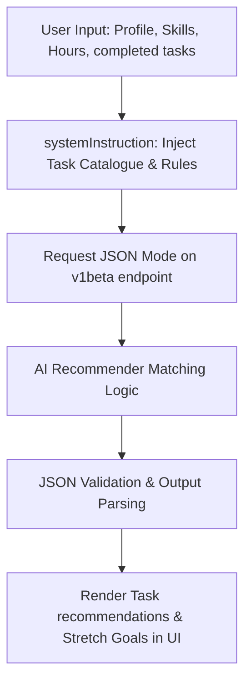

# GO-BRICS Task Intelligence Tool
[](https://opensource.org/licenses/MIT)

An AI-powered task recommendation and GBP audit system designed for GO-BRICS Business Lab participants. This tool utilizes Google Gemini to analyze profiles, recommend optimal tasks, and audit completed task submissions.

---

## 📖 Setup Manual (API & Configuration)

The tool connects directly to the Google Gemini API to run its recommender and auditor engines. 

### 1. How to get a Free Google Gemini API Key
1. Go to **[Google AI Studio](https://aistudio.google.com/)**.
2. Sign in with your Google account.
3. Click on the **"Create API key"** button.
4. Copy the generated key (it will look like `AIzaSy...`).

> [!NOTE]
> The Gemini API free tier provides **1,500 free requests per day** and **15 requests per minute** (RPM) at absolutely no cost. No billing or credit card is required.

### 2. How to Configure the Key in the App
You have two ways to load your API key into the application:

#### Option A: Through the Web UI (Recommended)
1. Open the tool in your browser (default: `http://127.0.0.1:3000`).
2. At the top of the form, click on **"▼ API CONFIGURATION"**.
3. Paste your Gemini API key in the password field.
4. The tool will automatically use this key for all subsequent recommendations and audits.

#### Option B: Pre-fill in Code (Permanent)
If you want to avoid pasting the key every time you open the app, you can pre-fill it directly in the code:
1. Open the file [index.html](file:///C:/Users/krish/OneDrive/Documents/go-brics-tool/index.html) in a text editor.
2. Locate the line containing the `DEFAULT_GEMINI_KEY` constant (around line 1015):
   ```javascript
   const DEFAULT_GEMINI_KEY = 'YOUR_API_KEY_HERE';
   ```
3. Replace the placeholder string with your actual API key and save the file.

---

## ⚙️ Technical Architecture & Ranking Algorithm

The **GO-BRICS Task Recommender** acts as a matching engine between a participant's profile and the official task catalogue. The system utilizes structured prompt engineering on **Gemini 2.5 Flash** with the following pipeline:



### The Recommender Ranking Logic
The underlying algorithm evaluates the catalogued tasks against the participant's profile using five strict heuristic rules:

1. **Department Constraint**: Tasks are first grouped by department. The system filters tasks to only include those belonging to the departments the participant selected.
2. **Skill Eligibility Fit**: The system parses the "Skills Required" field of each task. Tasks are ranked higher if they match the participant's explicit skill sets.
3. **Weekly Hours Allocation**: The estimated hours for each recommended task are validated against the participant's weekly availability. Tasks exceeding the hours are excluded from the main list.
4. **Prerequisite Verification**: High-grade tasks with prerequisites (e.g. PP05 requires PP02, PP03, PP04) are verified. A task is only recommended if its prerequisites are marked as completed by the user.
5. **Earning Priority Ranking**: After filtering, remaining eligible tasks are sorted first by **best fit** (skills matching index) and then **descending order of earning potential** (GBP value), returning the top 5 high-yield matches.
6. **Stretch Goal Selection**: The algorithm selects exactly one high-grade (Grade A or S) task requiring the participant's core skills but exceeding their hourly availability or prerequisite stage, marking it as a "Stretch Goal" to encourage progress.

---

## 🛠️ Common Troubleshooting

### 1. "API Limit Exceeded" Errors (HTTP 429)
* **What it means**: You have exceeded the free tier rate limit (15 requests per minute).
* **The Fix**:
  * Wait **60 seconds** for the cooling-down period to expire and try clicking the submit button again.
  * If the issue persists, create a new API key in Google AI Studio to refresh your daily quota limit.

### 2. "Invalid JSON payload" or "No JSON object found" Errors
* **What it means**: The API response was either blocked by a network firewall, cut off midway, or had formatting anomalies.
* **The Fix**:
  * Do a **Hard Refresh** on your browser (**`Ctrl + Shift + R`** or **`Cmd + Shift + R`** on Mac) to ensure the latest API parsing configurations and scripts are loaded cleanly.
  * Check your internet connection. A brief interruption can cause the API response to return truncated data.

### 3. Model Connection / Endpoint Errors (HTTP 404)
* **What it means**: The selected model name is not enabled on your API key's Google Cloud project, or the API is not enabled.
* **The Fix**:
  * Open the settings panel and verify that the API key entered is correct.
  * Go to the [Google Cloud API Library](https://console.cloud.google.com/apis/library), search for **"Generative Language API"**, and ensure it is marked as **"Enabled"** for the project tied to your key.

---

## 📂 Directory Layout

```text
go-brics-tool/
├── index.html        # Core React Application & Styling
├── package.json      # Dev dependencies & launch scripts
├── README.md         # Manual & Technical Architecture
├── LICENSE           # MIT License
├── .env.example      # Local environment variables template
└── .gitignore        # Staging blacklist rules for local secrets
```
