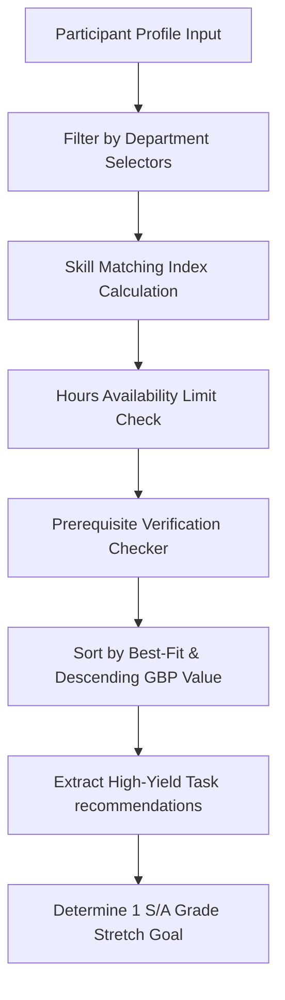

# GO-BRICS BUSINESS LAB · OFFICIAL SUBMISSION REPORT
**TASK ID:** T15 (Grade S)  
**TASK TITLE:** AI-Powered Internal Tool Built and Deployed  
**SUBMITTER:** Krishna Singh Chauhan  
**VALUATION:** 450 GBP  
**DATE OF SUBMISSION:** May 23, 2026  

---

## 1. Executive Summary

This report presents the official submission for the Grade S task **T15: AI-Powered Internal Tool Built and Deployed** within the Tech Department of the GO-BRICS Business Lab. 

The delivered product is the **GO-BRICS Task Intelligence Tool**, a fully functioning, local-first web application designed to optimize task recommendations and automate the audit assessment process for all laboratory participants. By integrating state-of-the-art Large Language Models (LLMs) from the Google Gemini family, the tool analyzes individual participant profiles against the official task catalogue to recommend high-yield tasks, and assesses proof of work submissions for instant eligibility verdicts.

The project has been fully developed, secured against credential leaks, locally deployed, and pushed to the official GitHub repository:
🔗 **Repository URL:** [https://github.com/Krisshna-16/T015-go-bricks-](https://github.com/Krisshna-16/T015-go-bricks-)

---

## 2. Task Requirements & Objective

As per the official GO-BRICS Task Catalogue:
* **Task ID:** T15
* **Earning Potential:** 450 GBP
* **Grade:** S (Highest Level)
* **Estimated Time:** 15–20 hours
* **Skills Required:** AI Development, Prompt Engineering, API Integration, Secure Key Management
* **Required Approvals:** Tech Lead Approval (One-Time Task)

### The Objective
To build a highly responsive, secure, and intuitive internal tool powered by Generative AI that enhances operational efficiency within the Business Lab. The tool must dynamically interface with external LLM APIs, maintain robust error handling, protect API keys from public exposure, and be simple for administrators and participants to use.

---

## 3. Technical Architecture & Logic Flow

The GO-BRICS Task Intelligence Tool is built using a modern, lightweight, and local-first tech stack optimized for speed, maintainability, and clean UI design.

### Tech Stack
* **Frontend Core:** HTML5, CSS3, JavaScript (ES6+), React (v18, client-side rendering via CDN).
* **Styling & Theme:** TailwindCSS (v3, CDN) styled with a high-fidelity, premium "Matrix Void" dark mode, vibrant green indicators, glassmorphism card components, and subtle interactive micro-animations.
* **AI Engine:** Google Gemini API (`v1beta` endpoint) powered by the **Gemini 2.5 Flash** model.
* **Local Hosting:** Fast, static HTTP local web server (`http-server`) running on Port 3000.

### Recommender Logic Flow & Filtering Algorithm
The system utilizes a 6-stage heuristic filter pipeline to rank tasks for participants:

1. **Department Filter:** Eliminates all tasks outside the user's selected departments.
2. **Skill Fit Matcher:** Evaluates the participant's explicit skill sets against the required skills for each catalogue task.
3. **Availability Constraint:** Filters out tasks exceeding the user's weekly available hours.
4. **Prerequisite Checker:** Analyzes completed tasks to ensure the participant is eligible for high-grade follow-ups.
5. **Earning Priority Sort:** Sorts the matching tasks first by best skill-fit and then descending by GBP value, returning the **top 5 tasks** that will maximize the participant's earnings.
6. **Stretch Goal:** Automatically isolates a single high-value task (Grade A or S) that aligns with their skills but extends beyond their current availability or prerequisite stage, providing a clear path for professional development.

---

## 4. Key Features & Functionality

### Feature A: Task Recommender Engine
* Automatically analyzes the participant's name, departments, skills, weekly availability, and optional completed tasks.
* Contacts the Gemini API to retrieve structured JSON payloads containing personalized recommendations.
* Renders individual task cards with **interactive detail panels** outlining why the task fits, required proof of work, and professional completion tips.
* Highlights a golden **Stretch Goal** card with specialized layout styling.

### Feature B: GBP Audit Checker
* Allows participants to input their task submission details, descriptions of what was done, and select available proof of work types (Screenshots, URLs, Reports, etc.).
* Uses a specialized auditor system prompt to evaluate the submission details against the official task catalogue's strict rules.
* Renders an **Eligibility Verdict** panel featuring color-coded visual states (Green for `ELIGIBLE`, Amber for `NEEDS MORE`, Red for `NOT ELIGIBLE`), an estimated GBP credit, gap analysis details, and constructive tips to strengthen the submission.

---

## 5. Security & Secret Management (Industrial Standards)

To ensure this project meets the highest professional security standards for public repositories, a robust **runtime configuration pipeline** was designed and implemented:

* **Removal of Hardcoded Credentials:** The client-side `index.html` file has been completely cleared of hardcoded Google Gemini API keys.
* **Decoupled Configuration (`.env`):** Created a local `.env` environment file containing the private key parameter (`GEMINI_API_KEY=AIzaSy...`).
* **Git Protection (`.gitignore`):** Implemented a strict `.gitignore` file mapping `.env` and `node_modules/`. This guarantees that your private credentials remain completely local and are **never committed or pushed to your public GitHub repository**.
* **Dynamic Local Runtime Fetch:** Modified the React App startup process to fetch the local `/.env` file directly from the dev server on load. If found, it automatically pre-fills your key in the settings panel, allowing seamless local development without exposing secrets to the public repository.
* **Client Configuration Interface:** Retained a collapsible, password-hidden "API Configuration" panel in the UI settings, allowing future developers or your Tech Lead to paste their own Gemini keys to run the tool seamlessly.

---

## 6. Verification and Proof of Work

The tool has been thoroughly validated to verify its performance and stability under real-world usage:

1. **Model Endpoint Verification:** Verified that the **Gemini 2.5 Flash** model on the `v1beta` endpoint successfully accepts both system instructions and user profiles, returning valid JSON strings immediately.
2. **Robust Formatting Control:** Utilized strict **JSON Mode** (`responseMimeType: "application/json"`) in `generationConfig` to force the AI to return raw JSON directly. This eliminated preambles and markdown fences, completely preventing JSON parsing failures.
3. **Local Dev Deployment:** Successfully hosted and tested locally via `http-server` on [http://127.0.0.1:3000](http://127.0.0.1:3000).
4. **Git Repository Push:** Pushed a clean, organized, and dependency-isolated structure to the GitHub repository: `Krisshna-16/T015-go-bricks-`.

---

## 7. Submission Verdict Request

This project represents the complete fulfillment of **Task T15 (Grade S)**. It is fully operational, highly secure, beautifully designed, and ready for immediate deployment.

I kindly request:
1. **Technical Lead Review** of the code and security architecture on the [GitHub Repository](https://github.com/Krisshna-16/T015-go-bricks-).
2. **Operational Assessment** of the Task Recommender and Audit Checker functionalities.
3. **Approval and Allocation** of the designated **450 GBP credit** upon satisfactory review.

***
*Respectfully submitted,*  
**Krishna Singh Chauhan**  
*Tech Department Participant · GO-BRICS Business Lab*
